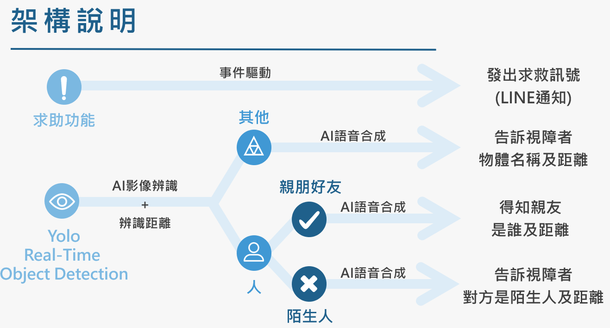

# eyes

**2019 年「中華電信 AIOT 黑客松大賽 」**

**組員: 許巧臻、葉亭妤、李杰穎、何長鴻** 

**指導老師: 陳彥安**

## 架構說明

## 作品主題說明
* 主要設計給視障者使用
* 讓盲人了解前方是什麼物體與兩者之間的距離
* 能清楚地知道自己的家人就站在面前

## 作品特色
* 透過MQTT上傳至中華電信大平台
* 使用Yolo: Real-Time Object Detection
* 使用中華電信大平台-AI影像辨識
* 使用中華電信大平台-AI語音合成
* 使用中華電信事件驅動-LINE通知
* 讓視障者可以活得像普通人一樣

## 開發工具
* Raspberry Pi 3B+
* 超音波HC-SR04 感測器
* C525 PORTABLE HD WEBCAM
